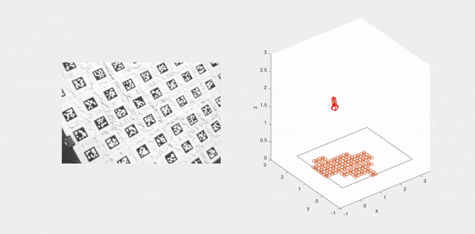

## Vision-based pose and velocity estimation

Following [MEAM 620 Advanced Robotics](https://alliance.seas.upenn.edu/~meam620/wiki/) course at University of Pennsylvania. 

This repo includes matlab code:
- Vision-based pose estimation
- Vision-based (linear & angular) velocity estimation
- Kalman Filters
- Useful tool functions for quaternion operations (`quat/`)

Check `refs/` for references that I found useful.
