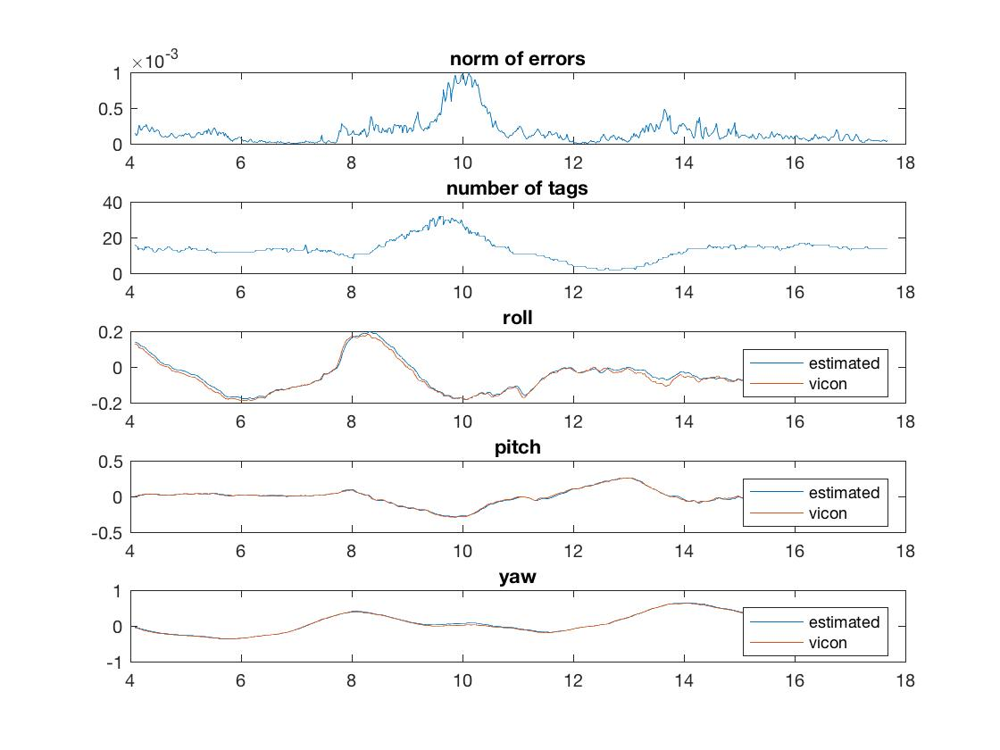
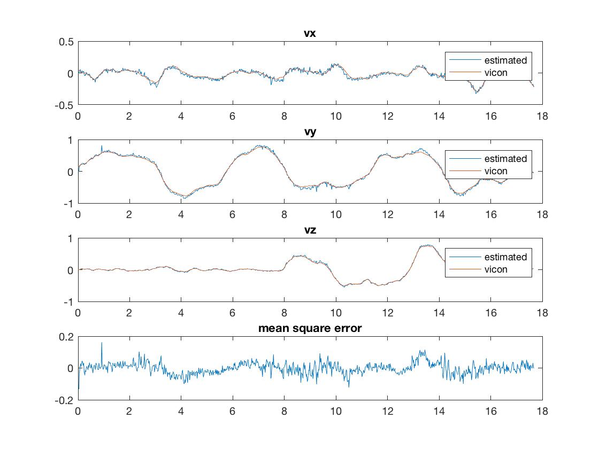

## Vision-based 3D Pose and Velocities Estimation

Following [MEAM 620 Advanced Robotics](https://alliance.seas.upenn.edu/~meam620/wiki/) course at University of Pennsylvania. 

This repo includes matlab code:
- Vision-based 3D pose estimation
- Vision-based 3D (linear & angular) velocity estimation
- Kalman Filters
- Useful tool functions for quaternion operations (`quat/`)

Check `refs/` for references that I found useful.

#### Plots

- position and orientation

 

- linear and angular velocities

 